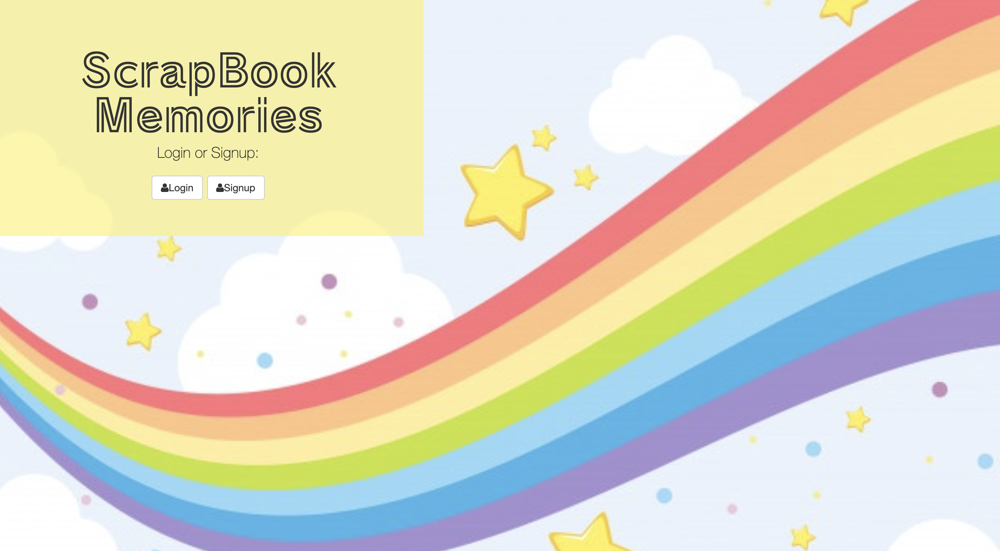
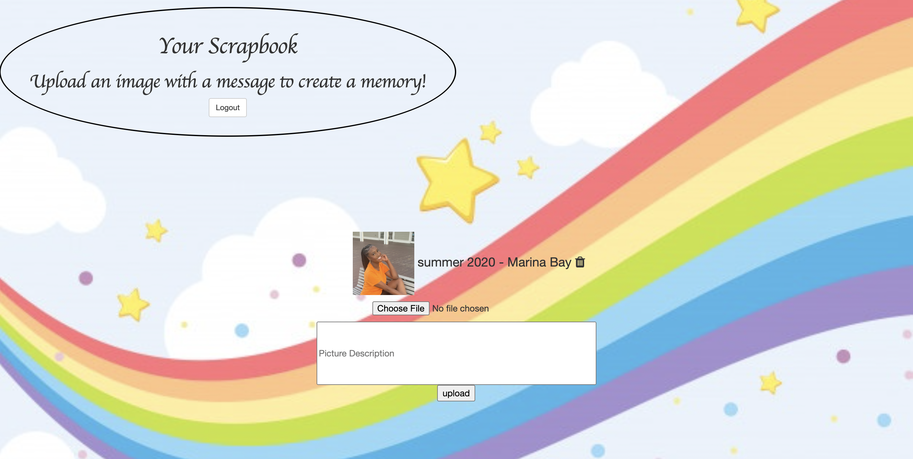

# ScrapBook - FullStack Auth App

- I created a ScrapBook full stack app where someone can create a profile and upload images and a description to keep an e-book of memories.

[Checkout my portfollio to see live app](https://www.tamikasterlin.com)

## How its Made:
### Tech Used:

- HTML, CSS, JavaScript, Express, Node.js, MongoDB

## Lessons Learned

- I learned how to use express and node.js to get my app running server side and to create user authentication. I also learned how to create a database using MondoDB and with that, I was able to practice using CRUD and rest api's.

## Other Projects

[Movie Quotes App - Express](https://github.com/TamikaSterlin/Personal-Express---Movie-Quotes)

[To Do List - Express](https://express-previous-todo.herokuapp.com/)

[Barista - FullStack Auth Express](https://github.com/TamikaSterlin/FullstackAppPersonalONE)
